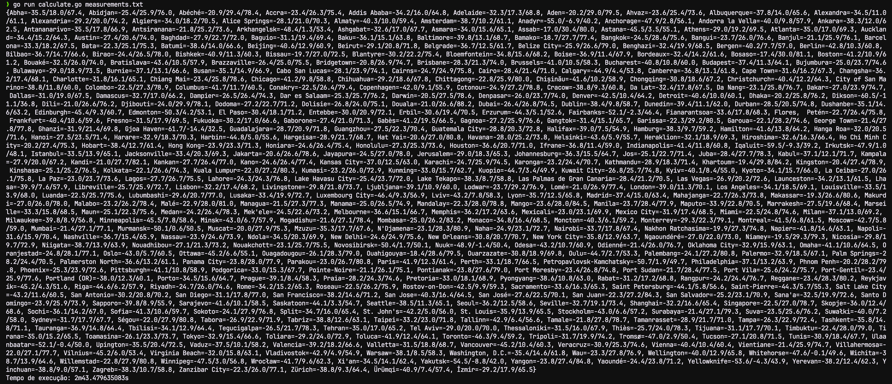

# Desafio do Arquivo de 1 Bilhão de Linhas

Este repositório contém uma solução para o desafio de processar um arquivo de dados com 1 bilhão de linhas, onde cada linha contém uma estação meteorológica e uma temperatura associada, no formato:
  
```
Hamburg;12.0
Bulawayo;8.9
Palembang;38.8
St. John's;15.2
Cracow;12.6
Bridgetown;26.9
Istanbul;6.2
Roseau;34.4
Conakry;31.2
Istanbul;23.0
```

## Como Executar

### Requisitos
- Go 
- Git

### Instruções

1. Clone o repositório.
2. Navegue até a pasta `src/main/go` do projeto.

3. Execute o script de geração de medidas para criar um arquivo de amostra (opcional):
```
go run ./generateMeasurements/generateMeasurements.go [número-de-linhas]
```

4. Execute o cálculo das estatísticas:
```
go run ./calculate/calculate.go ./generateMeasurements/measurements.txt
```

## Arquivos do projeto

Utilizei a linguagem Go devido à sua eficiência no processamento de arquivos grandes e sua facilidade de executar cálculos. O código é dividido em duas partes principais: geração de medidas e cálculo das estatísticas.

- **generateMeasurements.go**: Cria um arquivo de simulação contendo medidas de temperatura para diferentes estações meteorológicas.
- **calculate.go**: Lê o arquivo gerado, calcula as estatísticas de temperatura mínima, média e máxima para cada estação, e emite os resultados.

## Estratégia de Solução

### Importações
```go
import (
	"bufio"
	"fmt"
	"log"
	"os"
	"sort"
	"strconv"
	"strings"
)
```
Estas são as bibliotecas padrão do Go utilizadas no programa:
- `bufio` para leitura eficiente de arquivos grandes.
- `fmt` para formatação de strings e saída.
- `log` para registrar erros e saídas de falhas.
- `os` para interação com o sistema operacional, como abrir arquivos.
- `sort` para ordenar slices.
- `strconv` para conversão de strings para outros tipos, como `float64`.
- `strings` para manipulação de strings, como divisão de linhas.

### Estrutura de Dados
```go
type TempStats struct {
	Min   float64
	Max   float64
	Sum   float64
	Count int
}
```
A estrutura `TempStats` é definida para manter estatísticas sobre as temperaturas. Ela armazena a temperatura mínima (`Min`), máxima (`Max`), a soma de todas as temperaturas (`Sum`) e o número de temperaturas registradas (`Count`) para um dado local.

### Função Principal
```go
func main() {
	if len(os.Args) < 2 {
		log.Fatalf("Usage: %s <filename>", os.Args[0])
	}

	filename := os.Args[1]
	file, err := os.Open(filename)
	if err != nil {
		log.Fatalf("Failed to open file: %s", err)
	}
	defer file.Close()
```
A função `main` começa verificando se um nome de arquivo foi fornecido como argumento na linha de comando. Em seguida, tenta abrir o arquivo especificado. Se não conseguir abrir o arquivo, o programa registra um erro e encerra. `defer file.Close()` garante que o arquivo será fechado quando a função `main` terminar.

### Leitura e Processamento do Arquivo
```go
	stats := make(map[string]*TempStats)

	scanner := bufio.NewScanner(file)
	for scanner.Scan() {
		line := scanner.Text()
		parts := strings.Split(line, ";")
		if len(parts) != 2 {
			continue // skip malformed lines
		}

		city := parts[0]
		temp, err := strconv.ParseFloat(parts[1], 64)
		if err != nil {
			continue // skip lines with invalid temperature values
		}

		if _, exists := stats[city]; !exists {
			stats[city] = &TempStats{Min: temp, Max: temp, Sum: temp, Count: 1}
		} else {
			if temp < stats[city].Min {
				stats[city].Min = temp
			}
			if temp > stats[city].Max {
				stats[city].Max = temp
			}
			stats[city].Sum += temp
			stats[city].Count++
		}
	}

	if err := scanner.Err(); err != nil {
		log.Fatalf("Error reading file: %s", err)
	}
```
Este bloco de código cria um `bufio.Scanner` para ler o arquivo linha por linha. Para cada linha, ele divide a string pelo delimitador `";"` e processa as partes para extrair o nome da cidade e a temperatura. Se a cidade ainda não estiver no mapa `stats`, ela é adicionada com as estatísticas iniciais. Caso contrário, as estatísticas são atualizadas conforme necessário.

### Ordenação e Formatação dos Resultados
```go
	var cities []string
	for city := range stats {
		cities = append(cities, city)
	}
	sort.Strings(cities)

	result := "{"
	first := true
	for _, city := range cities {
		stat := stats[city]
		mean := stat.Sum / float64(stat.Count)
		if !first {
			result += ", "
		}
		result += fmt.Sprintf("%s=%.1f/%.1f/%.1f", city, stat.Min, mean, stat.Max)
		first = false
	}
	result += "}"

	fmt.Println(result)
}
```
Este trecho final recolhe todas as cidades do mapa `stats` em uma slice, ordena-as alfabeticamente e, em seguida, itera sobre cada cidade para calcular a média das temperaturas e formatar os resultados conforme especificado. A string `result` é construída para mostrar cada cidade com seus valores mínimos, médios e máximos de temperatura formatados e separados por vírgulas dentro de chaves `{}`.


## Melhor Resultado Obtido

```
{Abha=-35.5/18.0/67.4, Abidjan=-25.4/25.9/76.0, Abéché=-20.9/29.4/78.4, Accra=-23.4/26.3/75.4, Addis Ababa=-34.2/16.0/64.8, Adelaide=-32.3/17.3/68.8...}
Tempo de execução: 2m43.479635083s
```

### Comprovação do Resultado


O resultado acima mostra a saída final com as estatísticas de temperatura para cada estação meteorológica e o tempo de execução do programa.
